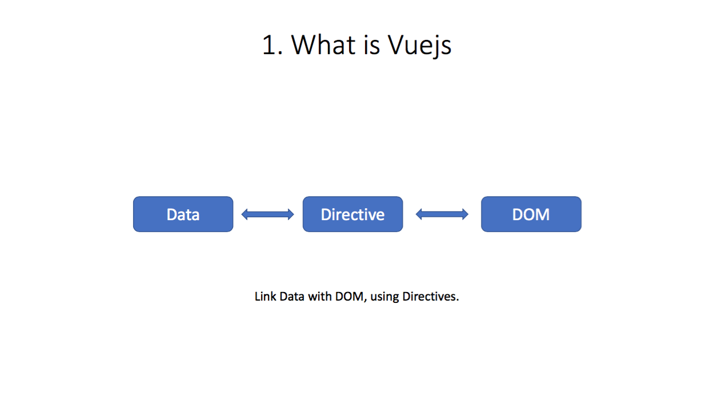
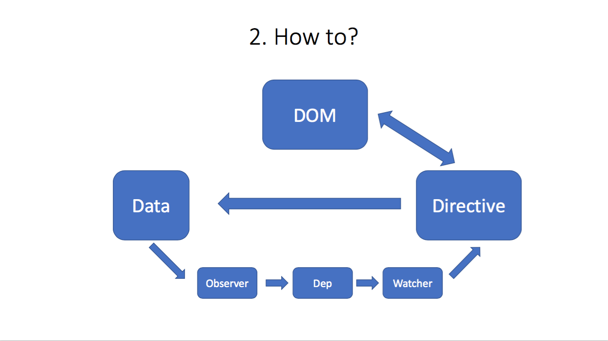
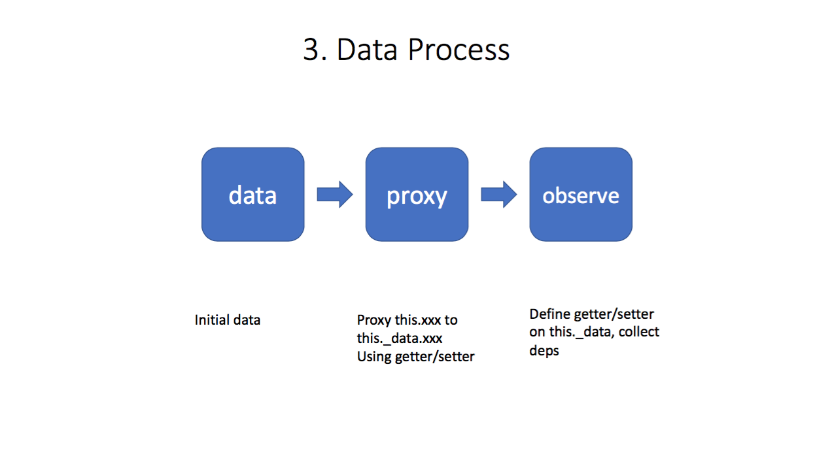
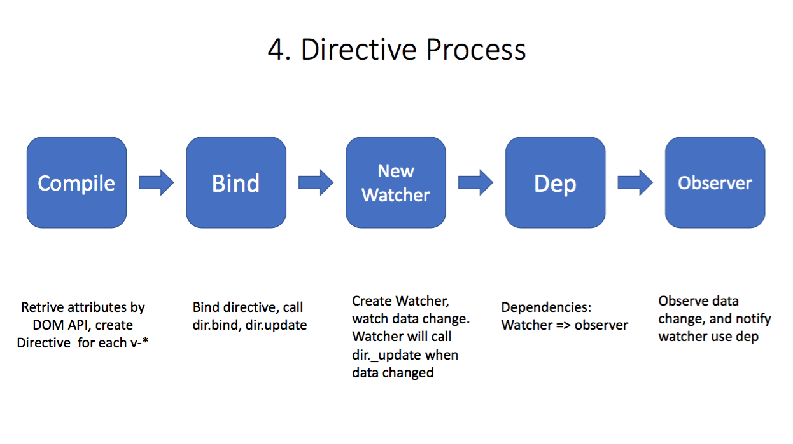

# tiny-vue

## 这是什么

[English README](./README.md)

这里有非常详细的教程，教你怎么写一个自己的tiny-vue [vue1.0源码解析系列](https://github.com/lihongxun945/myblog/labels/vue1.0%E6%BA%90%E7%A0%81%E8%A7%A3%E6%9E%90)

这是一个非常精简的vuejs的实现，主要用来学习vuejs v1.0.28 的源码。
Vuejs 的源码写的好，但是绕来绕去的逻辑以及比较复杂的link回调很容易把新手搞晕，如果你觉得直接上手看vuejs代码比较头疼，可以先尝试看这个项目的源码。
大部分的生命周期，函数名和vuejs是一样的。但是代码是完全重写的，除了 dep.js 和少量的函数是从vue.js复制来的。

主要实现了两个功能：

1. state: 响应式的数据，实现了对数据的监听，主要由三部分组成： State -> Observer -> Dep -> Watcher
2. directive: 对directive的支持，可以自己实现不同的directive。主要由三部分组成：Compile -> Directive -> directives/

你可以这样使用：

```
<div id="a">
	<input v-model="message" />
	<button v-on:click="increase">Increase</button>
	<p v-text="message"></p>
</div>
<script>
	new Vue({
		el: "#a",
		data: {
			message: 1
		},
		methods: {
			increase () {
				this.message += 1
			}
		}
	})
</script>
```

## 支持的特性

1. 响应式state.
2. 内置的指令: `v-on:click`, `v-text`, `v-model`
3. 双向数据绑定
4. 更多功能敬请期待...

## 实现原理






## Build Setup

``` bash
# install dependencies
npm install

# serve with hot reload at localhost:8080
npm run dev

# build for production with minification
npm run build
```

For detailed explanation on how things work, consult the [docs for vue-loader](http://vuejs.github.io/vue-loader).
